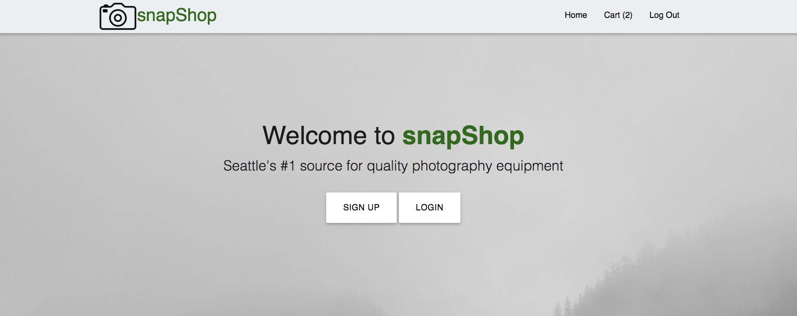
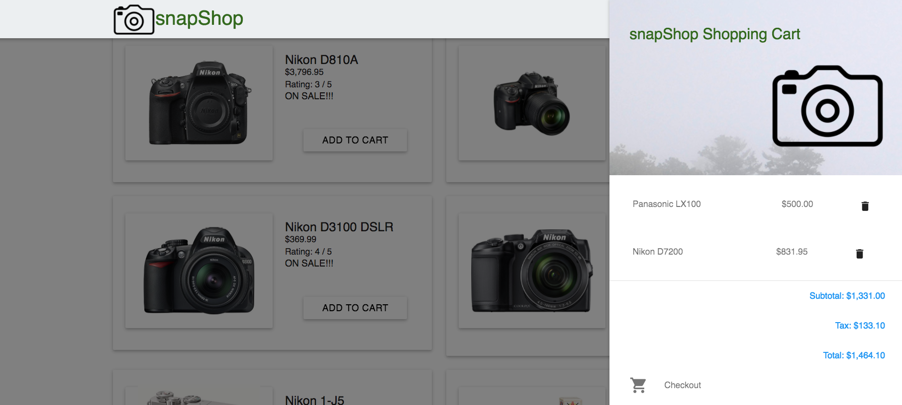

# SnapShop - A Camera Shopping Cart

SnapShop is an Angular.js app for a mock e-commerce site / Camera shop. This project focused on the Front-End, and was built in 3 days.

SnapShop allows users to dynamically search inventory and select cameras to Add To Cart, which automatically updates to reflect changes.  

Technologies used: Angular.js, Node.js, PostgreSQL, Express, Knex, JS/HTML/CSS, Materialize, and jQuery.

